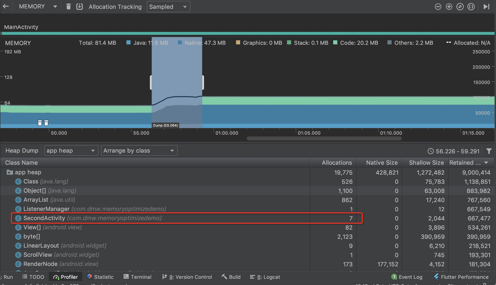

我们模拟一个内存泄漏的场景：

定义一个监听接口SampleListener
```
interface SampleListener {

    void click();
}

```
定义一个监听管理类ListenerManager，用来添加和删除SampleListener。我们需要创建一个ListenerManager单例类。

```
public class ListenerManager {

    //静态对象
    private static ListenerManager sInstance;

    private List<SampleListener> listeners = new ArrayList<>();

    private ListenerManager() {
    }

    public static ListenerManager getInstance() {
        if (sInstance == null) {
            sInstance = new ListenerManager();
        }

        return sInstance;
    }

    public void addListener(SampleListener listener) {
        listeners.add(listener);
    }

    public void removeListener(SampleListener listener) {
        listeners.remove(listener);
    }
}


```

然后让Activity实现SampleListener接口，在onCreate方法中注册监听。
```
class SecondActivity : AppCompatActivity(), SampleListener {

    companion object {

        val list = arrayListOf<String>()

        fun launch(context: Context) {
            val intent = Intent(context, SecondActivity::class.java)
            context.startActivity(intent)
        }
    }

    override fun onCreate(savedInstanceState: Bundle?) {
        super.onCreate(savedInstanceState)
        setContentView(R.layout.activity_second)
        ListenerManager.getInstance().addListener(this)
    }


    override fun click() {

    }

}
```
多次打开SecondActivity，因为我们只注册了监听，但是没有取消注册，
所以会导致ListenerManager类型的静态实例`sInstance`持有多个SecondActivity实例。造成内存泄漏。



我们可以看到现在内存中有7个SecondActivity实例，点击SecondActivity类，查看对应的Instance View面板。


然后我们点击一个实例对象，看看它的引用路径。


我们可以看到根本原因是ListenerManager类型的静态实例`sInstance`持有多个SecondActivity实例无法释放，造成内存泄漏。

关于这个引用路径怎么看，我的做法是就是从泄漏的实例开始depth=4，找到一条depth为0的路径。那么泄漏的原因就是这条路径上的对象造成的。在这里例子中就是ListenerManager类型的静态实例`sInstance`。


### 使用LeakCanary


使用adb命令查看应用内存信息
```
adb shell dumpsys meminfo packagename
```
```
adb shell dumpsys meminfo com.hm.viewdemo
```

```
Applications Memory Usage (in Kilobytes):
Uptime: 594249269 Realtime: 1316676869

** MEMINFO in pid 1777 [com.hm.viewdemo] **
                   Pss  Private  Private  SwapPss     Heap     Heap     Heap
                 Total    Dirty    Clean    Dirty     Size    Alloc     Free
                ------   ------   ------   ------   ------   ------   ------
  Native Heap     8717     8616        0     4113    22528    16168     6359
  Dalvik Heap     3154     3068        0       17    14819     2531    12288
 Dalvik Other     1473     1472        0       28                           
        Stack       80       80        0       16                           
       Ashmem        2        0        0        0                           
    Other dev       12        0       12        0                           
     .so mmap     4713      264     2680      111                           
    .apk mmap     2282     1960      124     4360                           
    .ttf mmap      270        0      160        0                           
    .dex mmap     5130        0     3272        4                           
    .oat mmap      159        0       52        0                           
    .art mmap     7112     4300     1244     2858                           
   Other mmap       10        4        4        1                           
      Unknown      416      408        0      422                           
        TOTAL    45460    20172     7548    11930    37347    18699    18647
 
 App Summary
                       Pss(KB)
                        ------
           Java Heap:     8612
         Native Heap:     8616
                Code:     8512
               Stack:       80
            Graphics:        0
       Private Other:     1900
              System:    17740
 
               TOTAL:    45460       TOTAL SWAP PSS:    11930
 
 Objects
               Views:       78         ViewRootImpl:        2
         AppContexts:        6           Activities:        2
              Assets:        7        AssetManagers:        0
       Local Binders:       17        Proxy Binders:       33
       Parcel memory:        4         Parcel count:       19
    Death Recipients:        0      OpenSSL Sockets:        0
            WebViews:        0
 
 SQL
         MEMORY_USED:        0
  PAGECACHE_OVERFLOW:        0          MALLOC_SIZE:        0
 

```
可以看到打印出来很多的信息，而对于我们查看Activity内存泄漏来说，只需要关注Activities和Views两个信息即可，
在应用中存在的Activity对象有2个，存在的View对象有78个。

这时候我们退出这个Activity，在用命令查看一下，可以看到应用中存在的Activity对象有0个，存在的View对象有0个。
通过这种方式可以简单判断一个Activity是否存在内存泄漏。

其中几个关键的数据：

* Private（Clean和Dirty的）：应用进程单独使用的内存，代表着系统杀死你的进程后可以实际回收的内存总量。通常需要特别关注其中更为昂贵的dirty部分，它不仅只被你的进程使用而且会持续占用内存而不能被从内存中置换出存储。申请的全部Dalvik和本地heap内存都是Dirty的，和Zygote共享的Dalvik和本地heap内存也都是Dirty的。
* Dalvik Heap：Dalvik虚拟机使用的内存，包含dalvik-heap和dalvik-zygote，堆内存，所有的Java对象实例都放在这里。
* Heap Alloc：累加了Dalvik和Native的heap。
* PSS：这是加入与其他进程共享的分页内存后你的应用占用的内存量，你的进程单独使用的全部内存也会加入这个值里，多进程共享的内存按照共享比例添加到PSS值中。如一个内存分页被两个进程共享，每个进程的PSS值会包括此内存分页大小的一半在内。Dalvik Pss内存 = 私有内存Private Dirty + （共享内存Shared Dirty / 共享进程数）。
* TOTAL：上面全部条目的累加值，全局的展示了你的进程占用的内存情况。
* ViewRootImpl：应用进程里的活动窗口视图个数，可以用来监测对话框或者其他窗口的内存泄露。
* AppContexts及Activities：应用进程里Context和Activity的对象个数，可以用来监测Activity的内存泄露。


参考链接：
1. [Android性能优化（三）之内存管理](https://juejin.im/post/58b18e442f301e0068028a90)
2. [使用 Memory Profiler 查看 Java 堆和内存分配](https://developer.android.google.cn/studio/profile/memory-profiler.html)
